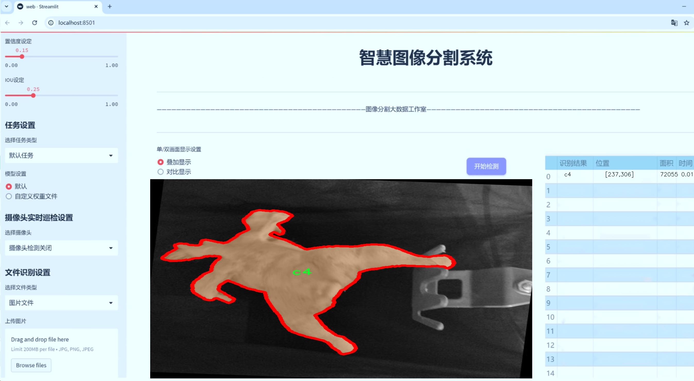
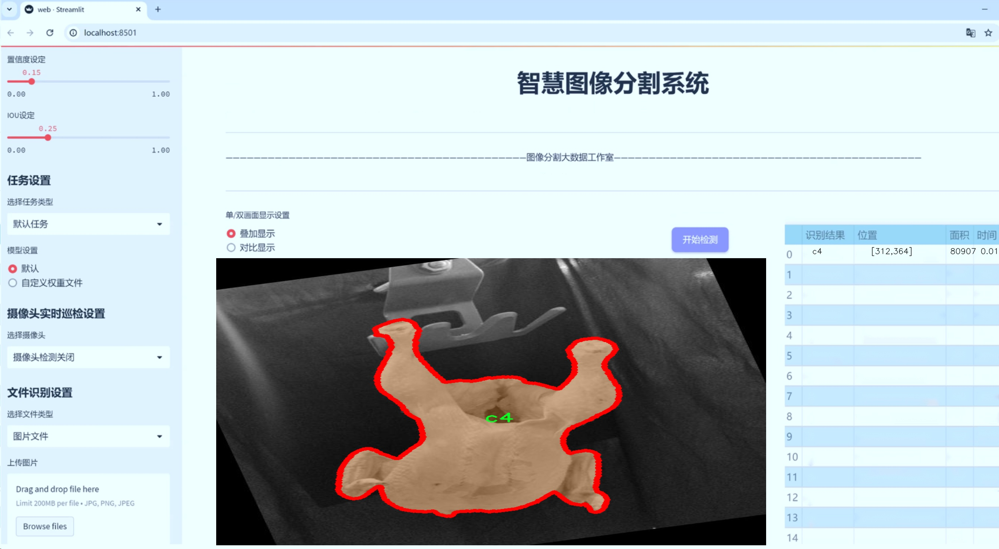
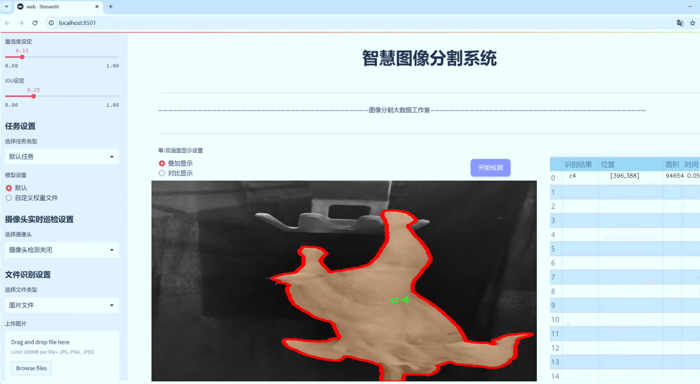
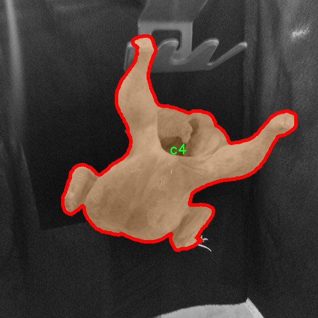
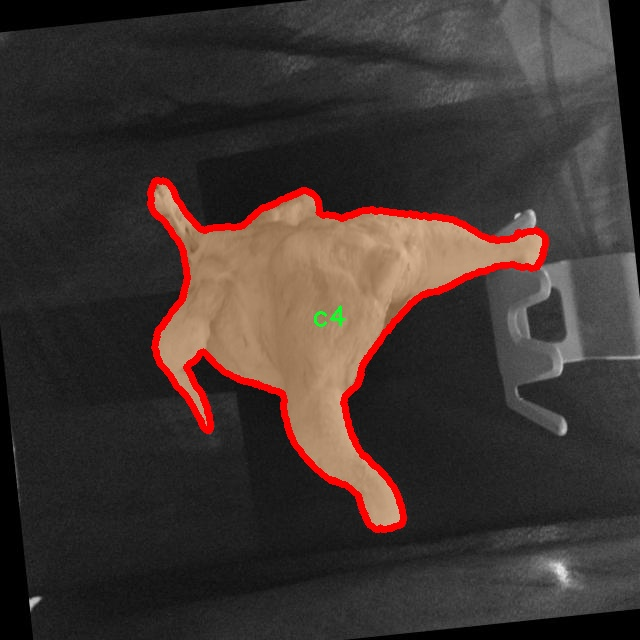
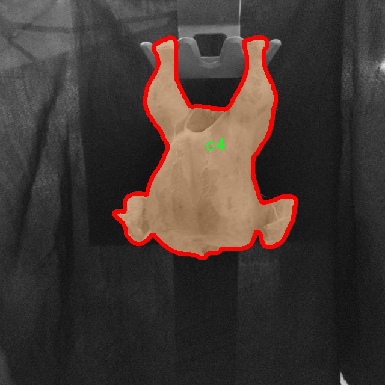
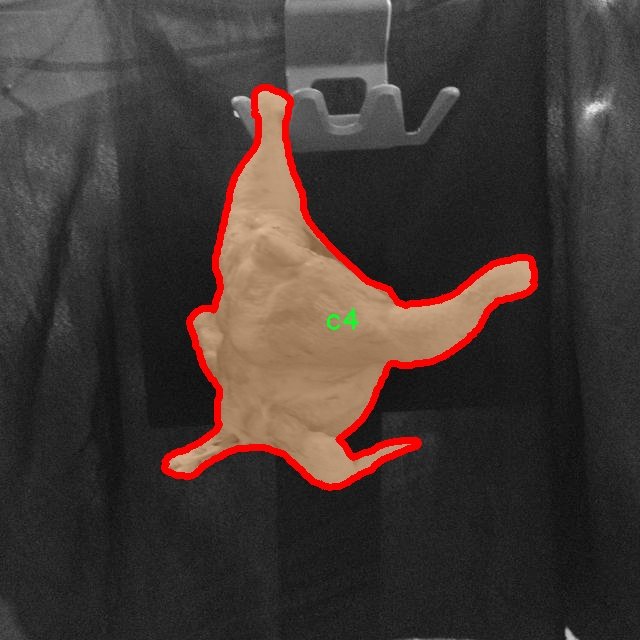
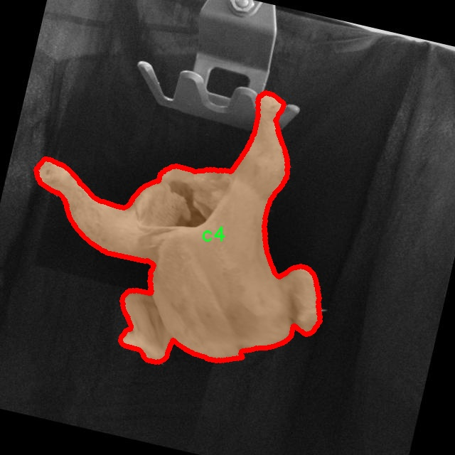

# 鸡只图像分割系统源码＆数据集分享
 [yolov8-seg-rtdetr＆yolov8-seg-p2等50+全套改进创新点发刊_一键训练教程_Web前端展示]

### 1.研究背景与意义

项目参考[ILSVRC ImageNet Large Scale Visual Recognition Challenge](https://gitee.com/YOLOv8_YOLOv11_Segmentation_Studio/projects)

项目来源[AAAI Global Al lnnovation Contest](https://kdocs.cn/l/cszuIiCKVNis)

研究背景与意义

随着农业现代化的不断推进，禽类养殖业在全球范围内正经历着快速的发展。在这一过程中，鸡只的健康管理、养殖效率提升以及产品质量控制等问题日益突出。传统的人工监测方法不仅耗时耗力，而且容易受到人为因素的影响，难以实现高效、精准的管理。因此，借助计算机视觉技术，尤其是深度学习中的图像分割技术，来实现对鸡只的自动化监测与管理，成为了一个亟待解决的研究课题。

YOLO（You Only Look Once）系列模型因其高效的实时目标检测能力而受到广泛关注。最新的YOLOv8模型在目标检测和分割任务中表现出色，具备了更高的准确性和更快的处理速度。然而，针对特定应用场景，如鸡只图像分割，YOLOv8的标准模型可能无法满足实际需求。因此，基于YOLOv8的改进版本进行鸡只图像分割系统的研究，具有重要的理论价值和实际意义。

本研究所使用的数据集“chicken_caliber”包含5200张图像，涵盖了五个不同的类别（c0至c4），为鸡只的实例分割提供了丰富的样本基础。这一数据集的构建不仅为模型的训练提供了必要的多样性，也为后续的模型评估与优化奠定了基础。通过对不同类别的鸡只进行有效的分割，能够帮助研究者更好地理解鸡只在不同生长阶段的形态特征，从而为鸡只的健康监测和疾病预警提供数据支持。

在实际应用中，基于改进YOLOv8的鸡只图像分割系统可以实现对鸡只的自动识别与计数，进而提高养殖场的管理效率。例如，通过对鸡只的生长状态进行实时监测，养殖户可以及时发现异常情况，采取相应的措施，降低养殖风险。此外，该系统还可以为鸡只的行为分析提供支持，帮助研究者深入探讨鸡只的生理特征与环境因素之间的关系，从而为科学养殖提供理论依据。

总之，基于改进YOLOv8的鸡只图像分割系统的研究，不仅能够推动计算机视觉技术在农业领域的应用，还将为禽类养殖业的智能化发展提供新的思路与方法。通过这一研究，我们期望能够实现鸡只的高效监测与管理，提高养殖效率，降低成本，并最终推动整个禽类养殖行业的可持续发展。这一研究不仅具有重要的学术价值，也将为实际生产提供切实可行的解决方案，具有广泛的应用前景。

### 2.图片演示







##### 注意：由于此博客编辑较早，上面“2.图片演示”和“3.视频演示”展示的系统图片或者视频可能为老版本，新版本在老版本的基础上升级如下：（实际效果以升级的新版本为准）

  （1）适配了YOLOV8的“目标检测”模型和“实例分割”模型，通过加载相应的权重（.pt）文件即可自适应加载模型。

  （2）支持“图片识别”、“视频识别”、“摄像头实时识别”三种识别模式。

  （3）支持“图片识别”、“视频识别”、“摄像头实时识别”三种识别结果保存导出，解决手动导出（容易卡顿出现爆内存）存在的问题，识别完自动保存结果并导出到tempDir中。

  （4）支持Web前端系统中的标题、背景图等自定义修改，后面提供修改教程。

  另外本项目提供训练的数据集和训练教程,暂不提供权重文件（best.pt）,需要您按照教程进行训练后实现图片演示和Web前端界面演示的效果。

### 3.视频演示

[3.1 视频演示](https://www.bilibili.com/video/BV1zFmzYAEWG/)

### 4.数据集信息展示

##### 4.1 本项目数据集详细数据（类别数＆类别名）

nc: 5
names: ['c0', 'c1', 'c2', 'c3', 'c4']


##### 4.2 本项目数据集信息介绍

数据集信息展示

在本研究中，我们使用了名为“chicken_caliber”的数据集，以支持改进YOLOv8-seg的鸡只图像分割系统的训练与验证。该数据集专门针对鸡只的图像分割任务而设计，旨在提高在农业领域中对鸡只进行精准识别和分割的能力。通过对这一数据集的深入分析，我们可以更好地理解其结构、内容以及在模型训练中的重要性。

“chicken_caliber”数据集包含五个类别，分别为‘c0’，‘c1’，‘c2’，‘c3’和‘c4’。这些类别可能代表不同的鸡只种类、不同的生长阶段或不同的健康状态，具体的类别定义将为后续的图像分割任务提供重要的上下文信息。每个类别的图像样本数量和质量直接影响到模型的训练效果，因此在数据集的构建过程中，确保每个类别都有足够的样本是至关重要的。

在数据集的构成上，“chicken_caliber”包含了多样化的图像，这些图像不仅涵盖了不同的拍摄角度和光照条件，还包含了不同的背景和环境。这种多样性有助于提高模型的泛化能力，使其能够在实际应用中更好地适应各种复杂场景。通过对这些图像进行标注，我们能够为YOLOv8-seg模型提供清晰的训练目标，使其能够学习到每个类别的特征。

此外，数据集的图像分辨率和质量也是影响模型性能的重要因素。高质量的图像能够提供更多的细节信息，从而使得分割结果更加精确。因此，在数据集的选择和处理过程中，我们特别关注图像的清晰度和细节表现，以确保训练出的模型能够在实际应用中实现高效的图像分割。

在训练过程中，我们将利用“chicken_caliber”数据集中的图像进行数据增强，以进一步提升模型的鲁棒性。数据增强技术如旋转、缩放、裁剪和颜色变换等，将帮助模型在面对不同的输入时，依然能够保持良好的分割性能。这种方法不仅能够增加训练样本的多样性，还能有效减少过拟合的风险。

通过对“chicken_caliber”数据集的全面分析和应用，我们期望能够显著提升YOLOv8-seg在鸡只图像分割任务中的表现。该数据集不仅为模型提供了丰富的训练素材，也为后续的研究提供了坚实的基础。随着研究的深入，我们相信这一数据集将为农业自动化和智能养殖的发展做出重要贡献，推动相关技术的进步与应用。最终，我们希望通过这一系统的改进，能够实现对鸡只的精准监测与管理，从而提高养殖效率和动物福利。











### 5.全套项目环境部署视频教程（零基础手把手教学）

[5.1 环境部署教程链接（零基础手把手教学）](https://www.bilibili.com/video/BV1jG4Ve4E9t/?vd_source=bc9aec86d164b67a7004b996143742dc)


[5.2 安装Python虚拟环境创建和依赖库安装视频教程链接（零基础手把手教学）](https://www.bilibili.com/video/BV1nA4VeYEze/?vd_source=bc9aec86d164b67a7004b996143742dc)

### 6.手把手YOLOV8-seg训练视频教程（零基础小白有手就能学会）

[6.1 手把手YOLOV8-seg训练视频教程（零基础小白有手就能学会）](https://www.bilibili.com/video/BV1cA4VeYETe/?vd_source=bc9aec86d164b67a7004b996143742dc)


按照上面的训练视频教程链接加载项目提供的数据集，运行train.py即可开始训练



     Epoch   gpu_mem       box       obj       cls    labels  img_size
     1/200     0G   0.01576   0.01955  0.007536        22      1280: 100%|██████████| 849/849 [14:42<00:00,  1.04s/it]
               Class     Images     Labels          P          R     mAP@.5 mAP@.5:.95: 100%|██████████| 213/213 [01:14<00:00,  2.87it/s]
                 all       3395      17314      0.994      0.957      0.0957      0.0843

     Epoch   gpu_mem       box       obj       cls    labels  img_size
     2/200     0G   0.01578   0.01923  0.007006        22      1280: 100%|██████████| 849/849 [14:44<00:00,  1.04s/it]
               Class     Images     Labels          P          R     mAP@.5 mAP@.5:.95: 100%|██████████| 213/213 [01:12<00:00,  2.95it/s]
                 all       3395      17314      0.996      0.956      0.0957      0.0845

     Epoch   gpu_mem       box       obj       cls    labels  img_size
     3/200     0G   0.01561    0.0191  0.006895        27      1280: 100%|██████████| 849/849 [10:56<00:00,  1.29it/s]
               Class     Images     Labels          P          R     mAP@.5 mAP@.5:.95: 100%|███████   | 187/213 [00:52<00:00,  4.04it/s]
                 all       3395      17314      0.996      0.957      0.0957      0.0845


### 7.50+种全套YOLOV8-seg创新点代码加载调参视频教程（一键加载写好的改进模型的配置文件）

[7.1 50+种全套YOLOV8-seg创新点代码加载调参视频教程（一键加载写好的改进模型的配置文件）](https://www.bilibili.com/video/BV1Hw4VePEXv/?vd_source=bc9aec86d164b67a7004b996143742dc)

### 8.YOLOV8-seg图像分割算法原理

原始YOLOv8-seg算法原理

YOLOv8-seg算法是YOLO系列目标检测算法的最新进展，旨在实现更高效的目标检测与分割。该算法在YOLOv5和YOLOv7的基础上进行了创新和改进，采用了更为先进的网络结构和算法设计，使得其在检测精度和速度上均有显著提升。YOLOv8-seg的整体架构依然遵循输入层、主干网络、特征融合层和解耦头的设计思路，但在细节上进行了多项优化，以适应更复杂的目标检测任务。

在YOLOv8-seg的主干网络中，依旧采用了CSPDarknet的思想，旨在通过深度学习提取图像特征。与YOLOv5不同的是，YOLOv8将C3模块替换为C2f模块，这一变更不仅保持了模型的轻量化特性，还有效提升了检测精度。C2f模块的设计灵感来源于YOLOv7的ELAN结构，具有两个分支的特性，使得网络在特征提取时能够更好地保留梯度流信息。具体而言，C2f模块通过多个Bottleneck结构的串并联组合，能够在保持输入输出通道一致的前提下，增强特征的重用能力，从而提高模型的整体性能。

在特征融合层，YOLOv8-seg采用了PAN-FPN结构，这一结构的设计目的是实现多尺度特征的深度融合。通过自下而上的特征融合方式，YOLOv8-seg能够有效整合来自不同层次的特征信息，确保模型在处理不同尺寸目标时具备更强的适应性。特别是在高层特征与中层、浅层特征的融合过程中，YOLOv8-seg通过去除1x1卷积，简化了特征融合的流程，从而提高了特征融合的效率。

YOLOv8-seg在目标检测的策略上也进行了创新，采用了Anchor-Free的思想，抛弃了传统的Anchor-Base方法。这一改变使得模型在处理目标时不再依赖于预设的锚框，而是通过直接回归目标的位置和类别，简化了模型的设计，提高了检测的灵活性。此外，YOLOv8-seg在损失函数的设计上也进行了优化，采用了VFLLoss作为分类损失，DFLLoss与CIoULoss作为回归损失，这一组合能够更好地处理样本不平衡问题，提高模型的学习效果。

在样本匹配策略上，YOLOv8-seg引入了Task-Aligned的Assigner匹配方式，这一策略使得模型在训练过程中能够更有效地匹配正负样本，进一步提升了检测精度。YOLOv8-seg在数据预处理方面延续了YOLOv5的策略，采用了马赛克增强、混合增强、空间扰动和颜色扰动等多种数据增强手段，以提升模型的泛化能力。

在网络的Head部分，YOLOv8-seg采用了解耦头的设计，这一设计使得分类和回归分支能够独立进行，从而加速了模型的收敛速度。通过将输出特征图的通道维度置换到最后，YOLOv8-seg能够有效地将不同尺度的特征进行整合，最终输出目标的类别和边框信息。具体而言，YOLOv8-seg的Head部分输出的特征图尺度为80x80、40x40和20x20，分别对应不同尺寸的目标检测。

在处理小目标时，YOLOv8-seg特别关注样本不平衡的问题，采用Focal Loss作为分类损失函数，能够有效缓解正负样本数量不均衡带来的影响。通过调整平衡参数和聚焦参数，YOLOv8-seg能够在训练过程中更好地聚焦于难以分类的样本，提高模型的学习效率。

综上所述，YOLOv8-seg算法通过对主干网络、特征融合层、样本匹配策略及损失函数等多个方面的优化，成功实现了目标检测与分割的高效融合。其在检测精度、速度和灵活性等方面的提升，使得YOLOv8-seg成为当前目标检测领域的一个重要里程碑。随着该算法的进一步发展和应用，预计将为智能监控、自动驾驶等领域带来更为广泛的应用前景。


### 9.系统功能展示（检测对象为举例，实际内容以本项目数据集为准）

图9.1.系统支持检测结果表格显示

  图9.2.系统支持置信度和IOU阈值手动调节

  图9.3.系统支持自定义加载权重文件best.pt(需要你通过步骤5中训练获得)

  图9.4.系统支持摄像头实时识别

  图9.5.系统支持图片识别

  图9.6.系统支持视频识别

  图9.7.系统支持识别结果文件自动保存

  图9.8.系统支持Excel导出检测结果数据


### 10.50+种全套YOLOV8-seg创新点原理讲解（非科班也可以轻松写刊发刊，V11版本正在科研待更新）

#### 10.1 由于篇幅限制，每个创新点的具体原理讲解就不一一展开，具体见下列网址中的创新点对应子项目的技术原理博客网址【Blog】：


[10.1 50+种全套YOLOV8-seg创新点原理讲解链接](https://gitee.com/qunmasj/good)

#### 10.2 部分改进模块原理讲解(完整的改进原理见上图和技术博客链接)【如果此小节的图加载失败可以通过CSDN或者Github搜索该博客的标题访问原始博客，原始博客图片显示正常】
### YOLOv8算法原理
YOLOv8算法由Glenn-Jocher 提出，是跟YOLOv3算法、YOLOv5算法一脉相承的，主要的改进点如下:
(1)数据预处理。YOLOv8的数据预处理依旧采用YOLOv5的策略,在训练时，主要采用包括马赛克增强(Mosaic)、混合增强(Mixup)、空间扰动(randomperspective)以及颜色扰动(HSV augment)四个增强手段。
(2)骨干网络结构。YOLOv8的骨干网络结构可从YOLOv5略见一斑，YOLOv5的主干网络的架构规律十分清晰，总体来看就是每用一层步长为2的3×3卷积去降采样特征图，接一个C3模块来进一步强化其中的特征，且C3的基本深度参数分别为“3/6/9/3”，其会根据不同规模的模型的来做相应的缩放。在的YOLOv8中，大体上也还是继承了这一特点，原先的C3模块均被替换成了新的C2f模块，C2f 模块加入更多的分支，丰富梯度回传时的支流。下面展示了YOLOv8的C2f模块和YOLOv5的C3模块，其网络结构图所示。


(3)FPN-PAN结构。YOLOv8仍采用FPN+PAN结构来构建YOLO的特征金字塔，使多尺度信息之间进行充分的融合。除了FPN-PAN里面的C3模块被替换为C2f模块外，其余部分与YOLOv5的FPN-PAN结构基本一致。
(4)Detection head结构。从 YOLOv3到 YOLOv5，其检测头一直都是“耦合”(Coupled)的,即使用一层卷积同时完成分类和定位两个任务，直到YOLOX的问世， YOLO系列才第一次换装“解耦头”(Decoupled Head)。YOLOv8也同样也采用了解耦头的结构，两条并行的分支分别取提取类别特征和位置特征，然后各用一层1x1卷积完成分类和定位任务。YOLOv8整体的网络结构由图所示。


(5)标签分配策略。尽管YOLOv5设计了自动聚类候选框的一些功能，但是聚类候选框是依赖于数据集的。若数据集不够充分，无法较为准确地反映数据本身的分布特征，聚类出来的候选框也会与真实物体尺寸比例悬殊过大。YOLOv8没有采用候选框策略，所以解决的问题就是正负样本匹配的多尺度分配。不同于YOLOX所使用的 SimOTA，YOLOv8在标签分配问题上采用了和YOLOv6相同的TOOD策略，是一种动态标签分配策略。YOLOv8只用到了targetboze。和target scores，未含是否有物体预测，故 YOLOv8的损失就主要包括两大部分∶类别损失和位置损失。对于YOLOv8，其分类损失为VFLLoss(Varifocal Loss)，其回归损失为CIoU Loss 与 DFL Loss 的形式。
其中 Varifocal Loss定义如下:


其中p为预测的类别得分，p ∈ [0.1]。q为预测的目标分数(若为真实类别，则q为预测和真值的 loU;若为其他类别。q为0 )。VFL Loss使用不对称参数来对正负样本进行加权，通过只对负样本进行衰减，达到不对等的处理前景和背景对损失的贡献。对正样本，使用q进行了加权，如果正样本的GTiou很高时,则对损失的贡献更大一些，可以让网络聚焦于那些高质量的样本上，即训练高质量的正例对AP的提升比低质量的更大一些。对负样本，使用p进行了降权，降低了负例对损失的贡献，因负样本的预测p在取次幂后会变得更小，这样就能够降低负样本对损失的整体贡献。

### 动态蛇形卷积Dynamic Snake Convolution

参考论文： 2307.08388.pdf (arxiv.org)

血管、道路等拓扑管状结构的精确分割在各个领域都至关重要，确保下游任务的准确性和效率。 然而，许多因素使任务变得复杂，包括薄的局部结构和可变的全局形态。在这项工作中，我们注意到管状结构的特殊性，并利用这些知识来指导我们的 DSCNet 在三个阶段同时增强感知：特征提取、特征融合、 和损失约束。 首先，我们提出了一种动态蛇卷积，通过自适应地关注细长和曲折的局部结构来准确捕获管状结构的特征。 随后，我们提出了一种多视图特征融合策略，以补充特征融合过程中多角度对特征的关注，确保保留来自不同全局形态的重要信息。 最后，提出了一种基于持久同源性的连续性约束损失函数，以更好地约束分割的拓扑连续性。 2D 和 3D 数据集上的实验表明，与多种方法相比，我们的 DSCNet 在管状结构分割任务上提供了更好的准确性和连续性。 我们的代码是公开的。 
主要的挑战源于细长微弱的局部结构特征与复杂多变的全局形态特征。本文关注到管状结构细长连续的特点，并利用这一信息在神经网络以下三个阶段同时增强感知：特征提取、特征融合和损失约束。分别设计了动态蛇形卷积（Dynamic Snake Convolution），多视角特征融合策略与连续性拓扑约束损失。 

我们希望卷积核一方面能够自由地贴合结构学习特征，另一方面能够在约束条件下不偏离目标结构太远。在观察管状结构的细长连续的特征后，脑海里想到了一个动物——蛇。我们希望卷积核能够像蛇一样动态地扭动，来贴合目标的结构。

我们希望卷积核一方面能够自由地贴合结构学习特征，另一方面能够在约束条件下不偏离目标结构太远。在观察管状结构的细长连续的特征后，脑海里想到了一个动物——蛇。我们希望卷积核能够像蛇一样动态地扭动，来贴合目标的结构。


### DCNV2融入YOLOv8
DCN和DCNv2（可变性卷积）
网上关于两篇文章的详细描述已经很多了，我这里具体的细节就不多讲了，只说一下其中实现起来比较困惑的点。（黑体字会讲解）

DCNv1解决的问题就是我们常规的图像增强，仿射变换（线性变换加平移）不能解决的多种形式目标变换的几何变换的问题。如下图所示。

可变性卷积的思想很简单，就是讲原来固定形状的卷积核变成可变的。如下图所示：


首先来看普通卷积，以3x3卷积为例对于每个输出y(p0)，都要从x上采样9个位置，这9个位置都在中心位置x(p0)向四周扩散得到的gird形状上，(-1,-1)代表x(p0)的左上角，(1,1)代表x(p0)的右下角，其他类似。

用公式表示如下：


可变性卷积Deformable Conv操作并没有改变卷积的计算操作，而是在卷积操作的作用区域上，加入了一个可学习的参数∆pn。同样对于每个输出y(p0)，都要从x上采样9个位置，这9个位置是中心位置x(p0)向四周扩散得到的，但是多了 ∆pn，允许采样点扩散成非gird形状。


偏移量是通过对原始特征层进行卷积得到的。比如输入特征层是w×h×c，先对输入的特征层进行卷积操作，得到w×h×2c的offset field。这里的w和h和原始特征层的w和h是一致的，offset field里面的值是输入特征层对应位置的偏移量，偏移量有x和y两个方向，所以offset field的channel数是2c。offset field里的偏移量是卷积得到的，可能是浮点数，所以接下来需要通过双向性插值计算偏移位置的特征值。在偏移量的学习中，梯度是通过双线性插值来进行反向传播的。
看到这里是不是还是有点迷茫呢？那到底程序上面怎么实现呢？


事实上由上面的公式我们可以看得出来∆pn这个偏移量是加在原像素点上的，但是我们怎么样从代码上对原像素点加这个量呢？其实很简单，就是用一个普通的卷积核去跟输入图片（一般是输入的feature_map）卷积就可以了卷积核的数量是2N也就是23*3==18（前9个通道是x方向的偏移量，后9个是y方向的偏移量），然后把这个卷积的结果与正常卷积的结果进行相加就可以了。
然后又有了第二个问题，怎么样反向传播呢？为什么会有这个问题呢？因为求出来的偏移量+正常卷积输出的结果往往是一个浮点数，浮点数是无法对应到原图的像素点的，所以自然就想到了双线性差值的方法求出浮点数对应的浮点像素点。


#### DCN v2
对于positive的样本来说，采样的特征应该focus在RoI内，如果特征中包含了过多超出RoI的内容，那么结果会受到影响和干扰。而negative样本则恰恰相反，引入一些超出RoI的特征有助于帮助网络判别这个区域是背景区域。

DCNv1引入了可变形卷积，能更好的适应目标的几何变换。但是v1可视化结果显示其感受野对应位置超出了目标范围，导致特征不受图像内容影响（理想情况是所有的对应位置分布在目标范围以内）。

为了解决该问题：提出v2, 主要有

1、扩展可变形卷积，增强建模能力
2、提出了特征模拟方案指导网络培训：feature mimicking scheme

上面这段话是什么意思呢，通俗来讲就是，我们的可变性卷积的区域大于目标所在区域，所以这时候就会对非目标区域进行错误识别。

所以自然能想到的解决方案就是加入权重项进行惩罚。（至于这个实现起来就比较简单了，直接初始化一个权重然后乘(input+offsets)就可以了）


可调节的RoIpooling也是类似的，公式如下：


### 11.项目核心源码讲解（再也不用担心看不懂代码逻辑）

#### 11.1 ui_style.py

以下是对您提供的代码进行逐文件分析后保留下来的核心部分，并附上详细的中文注释：

```python
import base64
import streamlit as st

# 读取图片并转换为 Base64 编码
def get_base64_of_bin_file(bin_file):
    # 以二进制模式打开文件
    with open(bin_file, 'rb') as file:
        data = file.read()  # 读取文件内容
    # 将读取的二进制数据进行 Base64 编码并解码为字符串
    return base64.b64encode(data).decode()

# 定义 Streamlit 应用的 CSS 样式
def def_css_hitml():
    st.markdown("""
        <style>
        /* 全局样式 */
        .css-2trqyj, .css-1d391kg, .st-bb, .st-at {
            font-family: 'Gill Sans', 'Gill Sans MT', Calibri, 'Trebuchet MS', sans-serif;  /* 设置字体 */
            background-color: #cadefc;  /* 设置背景颜色 */
            color: #21618C;  /* 设置字体颜色 */
        }

        /* 按钮样式 */
        .stButton > button {
            border: none;  /* 去掉边框 */
            color: white;  /* 字体颜色为白色 */
            padding: 10px 20px;  /* 设置内边距 */
            text-align: center;  /* 文本居中 */
            text-decoration: none;  /* 去掉下划线 */
            display: inline-block;  /* 使按钮为块级元素 */
            font-size: 16px;  /* 设置字体大小 */
            margin: 2px 1px;  /* 设置外边距 */
            cursor: pointer;  /* 鼠标悬停时显示为手型 */
            border-radius: 8px;  /* 设置圆角 */
            background-color: #9896f1;  /* 设置背景颜色 */
            box-shadow: 0 2px 4px 0 rgba(0,0,0,0.2);  /* 设置阴影效果 */
            transition-duration: 0.4s;  /* 设置过渡效果 */
        }
        .stButton > button:hover {
            background-color: #5499C7;  /* 鼠标悬停时改变背景颜色 */
            color: white;  /* 字体颜色为白色 */
            box-shadow: 0 8px 12px 0 rgba(0,0,0,0.24);  /* 鼠标悬停时改变阴影效果 */
        }

        /* 侧边栏样式 */
        .css-1lcbmhc.e1fqkh3o0 {
            background-color: #154360;  /* 设置侧边栏背景颜色 */
            color: #FDFEFE;  /* 设置侧边栏字体颜色 */
            border-right: 2px solid #DDD;  /* 设置右边框 */
        }

        /* 表格样式 */
        table {
            border-collapse: collapse;  /* 合并边框 */
            margin: 25px 0;  /* 设置外边距 */
            font-size: 18px;  /* 设置字体大小 */
            font-family: sans-serif;  /* 设置字体 */
            min-width: 400px;  /* 设置最小宽度 */
            box-shadow: 0 5px 15px rgba(0, 0, 0, 0.2);  /* 设置阴影效果 */
        }
        thead tr {
            background-color: #a8d8ea;  /* 设置表头背景颜色 */
            color: #ffcef3;  /* 设置表头字体颜色 */
            text-align: left;  /* 设置文本左对齐 */
        }
        th, td {
            padding: 15px 18px;  /* 设置单元格内边距 */
        }
        tbody tr {
            border-bottom: 2px solid #ddd;  /* 设置行底部边框 */
        }
        tbody tr:nth-of-type(even) {
            background-color: #D6EAF8;  /* 设置偶数行背景颜色 */
        }
        tbody tr:last-of-type {
            border-bottom: 3px solid #5499C7;  /* 设置最后一行底部边框 */
        }
        tbody tr:hover {
            background-color: #AED6F1;  /* 鼠标悬停时改变行背景颜色 */
        }
        </style>
        """, unsafe_allow_html=True)  # 允许使用 HTML
```

### 核心部分分析
1. **Base64 编码函数**：`get_base64_of_bin_file` 函数用于读取指定的二进制文件并将其转换为 Base64 编码的字符串。这在处理图像或其他二进制文件时非常有用。

2. **CSS 样式定义**：`def_css_hitml` 函数定义了应用的 CSS 样式，包括全局样式、按钮样式、侧边栏样式和表格样式。这些样式使得 Streamlit 应用的界面更加美观和用户友好。

3. **使用 Streamlit 的 Markdown 功能**：通过 `st.markdown` 方法将 CSS 样式嵌入到 Streamlit 应用中，使得样式能够被应用到组件上。

以上是对代码的核心部分和详细注释，希望对您理解代码的功能和结构有所帮助。

这个文件名为 `ui_style.py`，主要用于定义和应用 Streamlit 应用程序的样式。它通过 CSS 来美化用户界面，使得应用程序在视觉上更加吸引用户。

首先，文件导入了 `base64` 和 `streamlit` 库。`base64` 用于处理二进制文件的编码，而 `streamlit` 是一个用于构建数据应用的框架。

接下来，定义了一个名为 `get_base64_of_bin_file` 的函数，该函数接受一个二进制文件的路径作为参数。它会打开这个文件并读取其内容，然后将其转换为 Base64 编码并返回。这种编码方式常用于在网页中嵌入图像或其他媒体文件。

然后，定义了 `def_css_hitml` 函数，该函数通过 `st.markdown` 方法将一段 CSS 样式应用到 Streamlit 应用中。CSS 样式主要包括以下几个部分：

1. **全局样式**：设置了字体、背景颜色和文字颜色，确保整个应用的风格一致。
2. **按钮样式**：定义了按钮的外观，包括边框、颜色、内边距、字体大小、边距、圆角、背景色和阴影效果。同时还设置了按钮在鼠标悬停时的样式变化，使得用户体验更加友好。
3. **侧边栏样式**：为侧边栏设置了背景色、文字颜色和边框样式，使其在视觉上更加突出。
4. **Radio 按钮样式**：调整了单选按钮的显示方式，使其更易于使用和识别。
5. **滑块样式**：自定义了滑块的外观，包括滑块的指示点和轨道的颜色。
6. **表格样式**：为表格设置了边框、间距、字体样式和阴影效果，确保表格在视觉上整洁且易于阅读。还对表头和表格行的样式进行了详细定义，包括背景色、文字颜色和悬停效果。

总的来说，这个文件通过定义一系列 CSS 样式，旨在提升 Streamlit 应用的用户界面，使其更加美观和易于使用。

#### 11.2 ultralytics\engine\exporter.py

以下是代码中最核心的部分，并附上详细的中文注释：

```python
class Exporter:
    """
    用于导出模型的类。

    属性:
        args (SimpleNamespace): 导出器的配置。
        callbacks (list, optional): 回调函数列表。默认为 None。
    """

    def __init__(self, cfg=DEFAULT_CFG, overrides=None, _callbacks=None):
        """
        初始化 Exporter 类。

        参数:
            cfg (str, optional): 配置文件的路径。默认为 DEFAULT_CFG。
            overrides (dict, optional): 配置覆盖。默认为 None。
            _callbacks (dict, optional): 回调函数字典。默认为 None。
        """
        self.args = get_cfg(cfg, overrides)  # 获取配置
        self.callbacks = _callbacks or callbacks.get_default_callbacks()  # 设置回调函数

    @smart_inference_mode()
    def __call__(self, model=None):
        """在运行回调后返回导出文件/目录的列表。"""
        self.run_callbacks('on_export_start')  # 开始导出时运行回调
        fmt = self.args.format.lower()  # 将格式转换为小写
        fmts = tuple(export_formats()['Argument'][1:])  # 可用的导出格式
        flags = [x == fmt for x in fmts]  # 检查格式标志
        if sum(flags) != 1:
            raise ValueError(f"无效的导出格式='{fmt}'。有效格式为 {fmts}")

        # 设备选择
        self.device = select_device('cpu' if self.args.device is None else self.args.device)

        # 检查模型的类名
        model.names = check_class_names(model.names)

        # 输入数据
        im = torch.zeros(self.args.batch, 3, *self.imgsz).to(self.device)  # 创建输入张量

        # 更新模型
        model = deepcopy(model).to(self.device)  # 深拷贝模型并移动到指定设备
        model.eval()  # 设置模型为评估模式
        model.float()  # 转换为浮点数

        # 进行干运行以检查模型
        y = model(im)  # 运行模型
        self.output_shape = tuple(y.shape) if isinstance(y, torch.Tensor) else tuple()  # 获取输出形状

        # 导出模型
        f = [''] * len(fmts)  # 初始化导出文件名列表
        if 'torchscript' in self.args.format:
            f[0], _ = self.export_torchscript()  # 导出为 TorchScript
        if 'onnx' in self.args.format:
            f[1], _ = self.export_onnx()  # 导出为 ONNX

        # 完成导出
        f = [str(x) for x in f if x]  # 过滤掉空字符串
        self.run_callbacks('on_export_end')  # 导出结束时运行回调
        return f  # 返回导出文件/目录的列表

    @try_export
    def export_onnx(self, prefix=colorstr('ONNX:')):
        """导出 YOLOv8 为 ONNX 格式。"""
        import onnx  # 导入 ONNX 库

        opset_version = self.args.opset or get_latest_opset()  # 获取 ONNX 的 opset 版本
        f = str(self.file.with_suffix('.onnx'))  # 设置导出文件名

        # 导出模型为 ONNX 格式
        torch.onnx.export(
            self.model.cpu(),  # 将模型移动到 CPU
            self.im.cpu(),  # 将输入数据移动到 CPU
            f,
            opset_version=opset_version,
            input_names=['images'],  # 输入名称
            output_names=['output0'],  # 输出名称
        )

        return f, None  # 返回导出文件名
```

### 代码核心部分说明：
1. **Exporter 类**：这是一个用于导出模型的类，包含了初始化和导出功能。
2. **__init__ 方法**：用于初始化类的属性，包括配置和回调函数。
3. **__call__ 方法**：这个方法实现了导出逻辑，首先运行开始回调，然后根据指定格式导出模型，最后运行结束回调并返回导出文件列表。
4. **export_onnx 方法**：专门用于将模型导出为 ONNX 格式，设置输入输出名称并调用 PyTorch 的导出功能。

这些部分是整个模型导出流程的核心，负责处理模型的配置、选择设备、进行干运行、执行导出操作等。

这个程序文件`ultralytics/engine/exporter.py`主要用于将YOLOv8模型导出为多种格式，以便在不同的深度学习框架和设备上进行推理。程序的开头部分包含了导出格式的列表，包括PyTorch、TorchScript、ONNX、OpenVINO、TensorRT、CoreML、TensorFlow等，详细列出了每种格式对应的文件名后缀和支持的设备类型。

程序中首先导入了一系列必要的库和模块，包括处理文件和路径的库、时间处理、深度学习框架PyTorch、以及Ultralytics库中的一些功能模块。接着定义了一些辅助函数，比如`export_formats()`用于返回支持的导出格式，`gd_outputs()`用于获取TensorFlow GraphDef模型的输出节点名称，`try_export()`是一个装饰器，用于捕获导出过程中的异常并记录日志。

核心部分是`Exporter`类，它负责处理模型的导出。该类的构造函数接受配置文件路径、覆盖参数和回调函数等参数，并初始化相关属性。`__call__`方法是导出过程的主要逻辑，首先运行导出开始的回调，然后根据指定的格式进行相应的检查和处理。它会根据用户的输入选择导出格式，并进行设备选择、模型检查和输入数据准备。

在导出过程中，程序会进行多次检查，例如确保模型的类名、图像大小、设备类型等符合要求。然后，程序会进行模型的干运行以确认其有效性，并记录输出形状和元数据。接下来，程序根据所选格式调用相应的导出方法，如`export_torchscript()`、`export_onnx()`、`export_coreml()`等，分别处理不同格式的导出。

每个导出方法都被`try_export`装饰器包裹，以确保在导出过程中出现异常时能够记录相关信息。每个导出方法内部会执行具体的导出逻辑，并保存导出的模型文件，同时更新模型的元数据。

最后，程序会在导出完成后运行结束的回调，并返回导出的文件路径。整个过程的设计旨在提供灵活性和可扩展性，支持多种模型格式的导出，以适应不同的应用场景和需求。

#### 11.3 ultralytics\models\yolo\classify\predict.py

以下是经过简化和注释的核心代码部分：

```python
import torch
from ultralytics.engine.predictor import BasePredictor
from ultralytics.engine.results import Results
from ultralytics.utils import DEFAULT_CFG, ops

class ClassificationPredictor(BasePredictor):
    """
    ClassificationPredictor类用于基于分类模型进行预测。
    该类继承自BasePredictor类。
    """

    def __init__(self, cfg=DEFAULT_CFG, overrides=None, _callbacks=None):
        """初始化ClassificationPredictor，将任务设置为'分类'。"""
        super().__init__(cfg, overrides, _callbacks)  # 调用父类构造函数
        self.args.task = 'classify'  # 设置任务类型为分类

    def preprocess(self, img):
        """将输入图像转换为模型兼容的数据类型。"""
        # 如果输入不是torch.Tensor类型，则进行转换
        if not isinstance(img, torch.Tensor):
            img = torch.stack([self.transforms(im) for im in img], dim=0)  # 应用转换并堆叠成一个Tensor
        # 将图像移动到模型所在的设备（CPU或GPU）
        img = (img if isinstance(img, torch.Tensor) else torch.from_numpy(img)).to(self.model.device)
        # 根据模型的精度设置将图像转换为半精度或单精度浮点数
        return img.half() if self.model.fp16 else img.float()  # uint8 转换为 fp16/32

    def postprocess(self, preds, img, orig_imgs):
        """对预测结果进行后处理，返回Results对象。"""
        # 如果原始图像不是列表，则将其转换为numpy数组
        if not isinstance(orig_imgs, list):
            orig_imgs = ops.convert_torch2numpy_batch(orig_imgs)

        results = []  # 存储结果的列表
        for i, pred in enumerate(preds):  # 遍历每个预测结果
            orig_img = orig_imgs[i]  # 获取对应的原始图像
            img_path = self.batch[0][i]  # 获取图像路径
            # 创建Results对象并添加到结果列表中
            results.append(Results(orig_img, path=img_path, names=self.model.names, probs=pred))
        return results  # 返回处理后的结果列表
```

### 代码注释说明：
1. **导入模块**：导入必要的PyTorch和Ultralytics库模块。
2. **ClassificationPredictor类**：该类用于分类任务，继承自`BasePredictor`，实现了图像的预处理和后处理功能。
3. **`__init__`方法**：初始化类实例，设置任务类型为分类。
4. **`preprocess`方法**：负责将输入图像转换为模型可以处理的格式，包括类型转换和设备迁移。
5. **`postprocess`方法**：处理模型的预测结果，将其转换为`Results`对象，便于后续使用和分析。

这个程序文件是一个用于图像分类的预测器，名为 `ClassificationPredictor`，它继承自 `BasePredictor` 类。该类的主要功能是基于分类模型进行图像分类预测。文件开头包含了版权信息和必要的库导入，包括 PyTorch 和 Ultralytics 的相关模块。

在 `ClassificationPredictor` 类的构造函数 `__init__` 中，首先调用了父类的构造函数，并将任务类型设置为 'classify'，表示该预测器专注于分类任务。用户可以通过 `overrides` 参数传入自定义配置。

`preprocess` 方法负责对输入图像进行预处理，以确保其格式与模型兼容。它首先检查输入是否为 PyTorch 张量，如果不是，则将其转换为张量。在转换过程中，使用了 `self.transforms` 方法对每张图像进行处理，并将它们堆叠成一个批次。最后，图像被移动到模型所在的设备上，并根据模型的精度设置转换为半精度或单精度浮点数。

`postprocess` 方法用于对模型的预测结果进行后处理，以返回 `Results` 对象。它首先检查原始图像是否为列表，如果不是，则将其转换为 NumPy 数组。接着，方法遍历每个预测结果，将其与原始图像和图像路径关联，并将这些信息封装成 `Results` 对象，最终返回一个包含所有结果的列表。

这个类的设计允许用户使用不同的分类模型（例如 Torchvision 的模型）进行预测，提供了灵活性和可扩展性。通过示例代码，用户可以看到如何使用 `ClassificationPredictor` 类进行图像分类预测。整体来看，这个文件实现了图像分类任务的核心功能，提供了预处理和后处理的支持，使得模型的使用更加便捷。

#### 11.4 ultralytics\nn\extra_modules\ops_dcnv3\modules\__init__.py

以下是保留的核心代码部分，并附上详细的中文注释：

```python
# 导入DCNv3相关模块
from .dcnv3 import DCNv3, DCNv3_pytorch, DCNv3_DyHead

# 以上代码从当前包（.）中的dcnv3模块导入了三个类或函数：
# 1. DCNv3：可能是一个深度可分离卷积网络的实现，用于提高模型的性能。
# 2. DCNv3_pytorch：可能是针对PyTorch框架的DCNv3实现，方便在PyTorch中使用。
# 3. DCNv3_DyHead：可能是一个动态头部的实现，通常用于目标检测等任务中，提供更灵活的输出结构。
```

在这个代码片段中，主要功能是导入深度学习相关的模块，具体的实现细节和功能需要查看`dcnv3`模块的具体内容。

这个程序文件是一个Python模块的初始化文件，位于`ultralytics/nn/extra_modules/ops_dcnv3/modules/`目录下。文件的开头部分包含了一些版权信息，表明该代码是由OpenGVLab于2022年开发的，并且是根据MIT许可证进行授权的。这意味着用户可以自由使用、修改和分发该代码，只要遵循MIT许可证的条款。

接下来的代码部分是从同一目录下的`dcnv3`模块中导入了三个类或函数：`DCNv3`、`DCNv3_pytorch`和`DCNv3_DyHead`。这些导入的内容可能是与深度学习相关的操作或模型，特别是与动态卷积（DCN，Deformable Convolutional Networks）相关的实现。

通过这种方式，用户在导入`ultralytics.nn.extra_modules.ops_dcnv3.modules`模块时，可以直接使用`DCNv3`、`DCNv3_pytorch`和`DCNv3_DyHead`，而无需单独导入`dcnv3`模块。这种结构有助于模块的组织和使用，使得代码更加简洁和易于维护。

#### 11.5 ultralytics\engine\results.py

以下是代码中最核心的部分，并附上详细的中文注释：

```python
class BaseTensor(SimpleClass):
    """基础张量类，提供便捷的操作和设备管理方法。"""

    def __init__(self, data, orig_shape) -> None:
        """
        初始化 BaseTensor，包含数据和原始形状。

        参数:
            data (torch.Tensor | np.ndarray): 预测结果，例如边界框、掩码和关键点。
            orig_shape (tuple): 图像的原始形状。
        """
        assert isinstance(data, (torch.Tensor, np.ndarray))  # 确保数据是张量或数组
        self.data = data  # 存储数据
        self.orig_shape = orig_shape  # 存储原始形状

    @property
    def shape(self):
        """返回数据张量的形状。"""
        return self.data.shape

    def cpu(self):
        """返回在CPU内存上的张量副本。"""
        return self if isinstance(self.data, np.ndarray) else self.__class__(self.data.cpu(), self.orig_shape)

    def numpy(self):
        """返回张量的numpy数组副本。"""
        return self if isinstance(self.data, np.ndarray) else self.__class__(self.data.numpy(), self.orig_shape)

    def cuda(self):
        """返回在GPU内存上的张量副本。"""
        return self.__class__(torch.as_tensor(self.data).cuda(), self.orig_shape)

    def __len__(self):  # 重写len(results)
        """返回数据张量的长度。"""
        return len(self.data)

    def __getitem__(self, idx):
        """返回指定索引的数据张量副本。"""
        return self.__class__(self.data[idx], self.orig_shape)


class Results(SimpleClass):
    """
    存储和操作推理结果的类。

    参数:
        orig_img (numpy.ndarray): 原始图像的numpy数组。
        path (str): 图像文件的路径。
        names (dict): 类别名称的字典。
        boxes (torch.tensor, optional): 每个检测的边界框坐标的2D张量。
        masks (torch.tensor, optional): 检测掩码的3D张量，每个掩码是一个二值图像。
        probs (torch.tensor, optional): 每个类别的概率的1D张量。
        keypoints (List[List[float]], optional): 每个对象的检测关键点列表。

    属性:
        orig_img (numpy.ndarray): 原始图像的numpy数组。
        orig_shape (tuple): 原始图像的形状。
        boxes (Boxes, optional): 包含检测边界框的Boxes对象。
        masks (Masks, optional): 包含检测掩码的Masks对象。
        probs (Probs, optional): 包含分类任务每个类别概率的Probs对象。
        keypoints (Keypoints, optional): 包含每个对象检测关键点的Keypoints对象。
    """

    def __init__(self, orig_img, path, names, boxes=None, masks=None, probs=None, keypoints=None) -> None:
        """初始化 Results 类。"""
        self.orig_img = orig_img  # 存储原始图像
        self.orig_shape = orig_img.shape[:2]  # 存储原始图像的形状
        self.boxes = Boxes(boxes, self.orig_shape) if boxes is not None else None  # 存储边界框
        self.masks = Masks(masks, self.orig_shape) if masks is not None else None  # 存储掩码
        self.probs = Probs(probs) if probs is not None else None  # 存储概率
        self.keypoints = Keypoints(keypoints, self.orig_shape) if keypoints is not None else None  # 存储关键点
        self.names = names  # 存储类别名称
        self.path = path  # 存储图像路径

    def update(self, boxes=None, masks=None, probs=None):
        """更新 Results 对象的边界框、掩码和概率属性。"""
        if boxes is not None:
            ops.clip_boxes(boxes, self.orig_shape)  # 裁剪边界框
            self.boxes = Boxes(boxes, self.orig_shape)
        if masks is not None:
            self.masks = Masks(masks, self.orig_shape)
        if probs is not None:
            self.probs = probs

    def plot(self, conf=True, boxes=True, masks=True, probs=True):
        """
        在输入RGB图像上绘制检测结果。

        参数:
            conf (bool): 是否绘制检测置信度分数。
            boxes (bool): 是否绘制边界框。
            masks (bool): 是否绘制掩码。
            probs (bool): 是否绘制分类概率。

        返回:
            (numpy.ndarray): 注释图像的numpy数组。
        """
        # 创建Annotator对象用于绘制
        annotator = Annotator(deepcopy(self.orig_img), example=self.names)

        # 绘制掩码
        if self.masks and masks:
            annotator.masks(self.masks.data)

        # 绘制边界框
        if self.boxes and boxes:
            for d in self.boxes:
                annotator.box_label(d.xyxy.squeeze(), f'{self.names[int(d.cls)]} {d.conf:.2f}')

        # 绘制分类概率
        if self.probs is not None and probs:
            text = ', '.join(f'{self.names[j]} {self.probs.data[j]:.2f}' for j in self.probs.top5)
            annotator.text([10, 10], text)

        return annotator.result()  # 返回绘制后的图像


class Boxes(BaseTensor):
    """
    存储和操作检测边界框的类。

    参数:
        boxes (torch.Tensor | numpy.ndarray): 包含检测边界框的张量或数组。
        orig_shape (tuple): 原始图像大小，格式为 (高度, 宽度)。

    属性:
        xyxy (torch.Tensor | numpy.ndarray): 边界框的xyxy格式。
        conf (torch.Tensor | numpy.ndarray): 边界框的置信度值。
        cls (torch.Tensor | numpy.ndarray): 边界框的类别值。
    """

    def __init__(self, boxes, orig_shape) -> None:
        """初始化 Boxes 类。"""
        super().__init__(boxes, orig_shape)

    @property
    def xyxy(self):
        """返回边界框的xyxy格式。"""
        return self.data[:, :4]

    @property
    def conf(self):
        """返回边界框的置信度值。"""
        return self.data[:, -2]

    @property
    def cls(self):
        """返回边界框的类别值。"""
        return self.data[:, -1]


class Masks(BaseTensor):
    """
    存储和操作检测掩码的类。

    属性:
        xy (list): 像素坐标的段列表。
        xyn (list): 归一化段的列表。
    """

    def __init__(self, masks, orig_shape) -> None:
        """初始化 Masks 类。"""
        super().__init__(masks, orig_shape)

    @property
    def xyn(self):
        """返回归一化的段。"""
        return [ops.scale_coords(self.data.shape[1:], x, self.orig_shape, normalize=True) for x in ops.masks2segments(self.data)]


class Keypoints(BaseTensor):
    """
    存储和操作检测关键点的类。

    属性:
        xy (torch.Tensor): 包含每个检测的关键点的x, y坐标的集合。
        conf (torch.Tensor): 与关键点相关的置信度值。
    """

    def __init__(self, keypoints, orig_shape) -> None:
        """初始化 Keypoints 类。"""
        super().__init__(keypoints, orig_shape)

    @property
    def xy(self):
        """返回关键点的x, y坐标。"""
        return self.data[..., :2]

    @property
    def conf(self):
        """返回关键点的置信度值。"""
        return self.data[..., 2] if self.data.shape[-1] == 3 else None
```

以上代码展示了处理YOLO推理结果的核心类，包括 `BaseTensor`、`Results`、`Boxes`、`Masks` 和 `Keypoints`。每个类都有其特定的功能和属性，提供了对检测结果的有效管理和操作。

这个程序文件是Ultralytics YOLO（You Only Look Once）模型的一个重要组成部分，主要用于处理推理结果，包括检测框、掩码和关键点等。文件中定义了多个类，主要包括`BaseTensor`、`Results`、`Boxes`、`Masks`、`Keypoints`和`Probs`，每个类都有其特定的功能和属性。

`BaseTensor`类是一个基础类，提供了一些通用的方法来处理张量数据，包括在不同设备（CPU和GPU）之间的转换，以及将张量转换为NumPy数组等。它还重载了`__len__`和`__getitem__`方法，以便能够方便地获取张量的长度和特定索引的数据。

`Results`类用于存储和操作推理结果。它包含了原始图像、检测框、掩码、概率和关键点等信息。该类提供了更新推理结果、转换设备、绘制检测结果和保存结果等功能。它的`plot`方法可以在输入图像上绘制检测结果，包括边界框、掩码和关键点等，支持多种可视化选项。

`Boxes`类专门用于处理检测框，提供了对框的各种格式（如xyxy和xywh）的转换，并且可以获取框的置信度和类别信息。`Masks`类用于处理检测掩码，提供了对掩码的像素坐标和归一化坐标的访问。`Keypoints`类则用于处理关键点信息，支持获取关键点的坐标和置信度。

`Probs`类用于处理分类任务的概率信息，提供了获取前五个类的索引和置信度的方法。

整体来看，这个文件的主要目的是提供一个结构化的方式来处理YOLO模型的推理结果，使得用户可以方便地访问和操作这些结果，同时支持多种输出格式和可视化功能。

### 12.系统整体结构（节选）

### 整体功能和构架概括

该程序是一个基于Ultralytics YOLO模型的深度学习框架，主要用于目标检测和图像分类任务。程序的整体架构包括多个模块，每个模块负责特定的功能，形成一个完整的工作流。以下是主要模块的功能概述：

1. **样式管理**：`ui_style.py`负责定义和应用Streamlit应用的用户界面样式，使得应用在视觉上更加美观和用户友好。
2. **模型导出**：`exporter.py`用于将训练好的YOLO模型导出为多种格式，以便在不同的深度学习框架和设备上进行推理。
3. **图像分类预测**：`predict.py`实现了图像分类的预测功能，提供了图像预处理和后处理的支持，方便用户使用不同的分类模型进行预测。
4. **动态卷积模块**：`__init__.py`用于组织和导入与动态卷积（DCN）相关的模块，简化用户的导入过程。
5. **推理结果处理**：`results.py`负责处理模型的推理结果，包括检测框、掩码和关键点等，提供了可视化和结果操作的功能。

### 文件功能整理表

| 文件路径                                          | 功能描述                                                                                     |
|--------------------------------------------------|----------------------------------------------------------------------------------------------|
| `C:\codeseg\codenew\code\ui_style.py`           | 定义和应用Streamlit应用的CSS样式，提升用户界面的美观性和友好性。                           |
| `C:\codeseg\codenew\code\ultralytics\engine\exporter.py` | 将YOLO模型导出为多种格式（如ONNX、TensorFlow等），以便在不同框架和设备上进行推理。         |
| `C:\codeseg\codenew\code\ultralytics\models\yolo\classify\predict.py` | 实现图像分类的预测功能，包括图像的预处理和后处理，支持使用不同的分类模型进行预测。       |
| `C:\codeseg\codenew\code\ultralytics\nn\extra_modules\ops_dcnv3\modules\__init__.py` | 导入与动态卷积（DCN）相关的模块，简化模块的组织和使用。                                   |
| `C:\codeseg\codenew\code\ultralytics\engine\results.py` | 处理模型的推理结果，包括检测框、掩码和关键点，提供可视化和结果操作的功能。               |

通过以上模块的协作，程序能够实现从模型训练到推理结果处理的完整流程，为用户提供了一个强大的深度学习工具。

注意：由于此博客编辑较早，上面“11.项目核心源码讲解（再也不用担心看不懂代码逻辑）”中部分代码可能会优化升级，仅供参考学习，完整“训练源码”、“Web前端界面”和“50+种创新点源码”以“14.完整训练+Web前端界面+50+种创新点源码、数据集获取”的内容为准。

### 13.图片、视频、摄像头图像分割Demo(去除WebUI)代码

在这个博客小节中，我们将讨论如何在不使用WebUI的情况下，实现图像分割模型的使用。本项目代码已经优化整合，方便用户将分割功能嵌入自己的项目中。
核心功能包括图片、视频、摄像头图像的分割，ROI区域的轮廓提取、类别分类、周长计算、面积计算、圆度计算以及颜色提取等。
这些功能提供了良好的二次开发基础。

### 核心代码解读

以下是主要代码片段，我们会为每一块代码进行详细的批注解释：

```python
import random
import cv2
import numpy as np
from PIL import ImageFont, ImageDraw, Image
from hashlib import md5
from model import Web_Detector
from chinese_name_list import Label_list

# 根据名称生成颜色
def generate_color_based_on_name(name):
    ......

# 计算多边形面积
def calculate_polygon_area(points):
    return cv2.contourArea(points.astype(np.float32))

...
# 绘制中文标签
def draw_with_chinese(image, text, position, font_size=20, color=(255, 0, 0)):
    image_pil = Image.fromarray(cv2.cvtColor(image, cv2.COLOR_BGR2RGB))
    draw = ImageDraw.Draw(image_pil)
    font = ImageFont.truetype("simsun.ttc", font_size, encoding="unic")
    draw.text(position, text, font=font, fill=color)
    return cv2.cvtColor(np.array(image_pil), cv2.COLOR_RGB2BGR)

# 动态调整参数
def adjust_parameter(image_size, base_size=1000):
    max_size = max(image_size)
    return max_size / base_size

# 绘制检测结果
def draw_detections(image, info, alpha=0.2):
    name, bbox, conf, cls_id, mask = info['class_name'], info['bbox'], info['score'], info['class_id'], info['mask']
    adjust_param = adjust_parameter(image.shape[:2])
    spacing = int(20 * adjust_param)

    if mask is None:
        x1, y1, x2, y2 = bbox
        aim_frame_area = (x2 - x1) * (y2 - y1)
        cv2.rectangle(image, (x1, y1), (x2, y2), color=(0, 0, 255), thickness=int(3 * adjust_param))
        image = draw_with_chinese(image, name, (x1, y1 - int(30 * adjust_param)), font_size=int(35 * adjust_param))
        y_offset = int(50 * adjust_param)  # 类别名称上方绘制，其下方留出空间
    else:
        mask_points = np.concatenate(mask)
        aim_frame_area = calculate_polygon_area(mask_points)
        mask_color = generate_color_based_on_name(name)
        try:
            overlay = image.copy()
            cv2.fillPoly(overlay, [mask_points.astype(np.int32)], mask_color)
            image = cv2.addWeighted(overlay, 0.3, image, 0.7, 0)
            cv2.drawContours(image, [mask_points.astype(np.int32)], -1, (0, 0, 255), thickness=int(8 * adjust_param))

            # 计算面积、周长、圆度
            area = cv2.contourArea(mask_points.astype(np.int32))
            perimeter = cv2.arcLength(mask_points.astype(np.int32), True)
            ......

            # 计算色彩
            mask = np.zeros(image.shape[:2], dtype=np.uint8)
            cv2.drawContours(mask, [mask_points.astype(np.int32)], -1, 255, -1)
            color_points = cv2.findNonZero(mask)
            ......

            # 绘制类别名称
            x, y = np.min(mask_points, axis=0).astype(int)
            image = draw_with_chinese(image, name, (x, y - int(30 * adjust_param)), font_size=int(35 * adjust_param))
            y_offset = int(50 * adjust_param)

            # 绘制面积、周长、圆度和色彩值
            metrics = [("Area", area), ("Perimeter", perimeter), ("Circularity", circularity), ("Color", color_str)]
            for idx, (metric_name, metric_value) in enumerate(metrics):
                ......

    return image, aim_frame_area

# 处理每帧图像
def process_frame(model, image):
    pre_img = model.preprocess(image)
    pred = model.predict(pre_img)
    det = pred[0] if det is not None and len(det)
    if det:
        det_info = model.postprocess(pred)
        for info in det_info:
            image, _ = draw_detections(image, info)
    return image

if __name__ == "__main__":
    cls_name = Label_list
    model = Web_Detector()
    model.load_model("./weights/yolov8s-seg.pt")

    # 摄像头实时处理
    cap = cv2.VideoCapture(0)
    while cap.isOpened():
        ret, frame = cap.read()
        if not ret:
            break
        ......

    # 图片处理
    image_path = './icon/OIP.jpg'
    image = cv2.imread(image_path)
    if image is not None:
        processed_image = process_frame(model, image)
        ......

    # 视频处理
    video_path = ''  # 输入视频的路径
    cap = cv2.VideoCapture(video_path)
    while cap.isOpened():
        ret, frame = cap.read()
        ......
```


### 14.完整训练+Web前端界面+50+种创新点源码、数据集获取


# [下载链接：https://mbd.pub/o/bread/Z5WalJly](https://mbd.pub/o/bread/Z5WalJly)